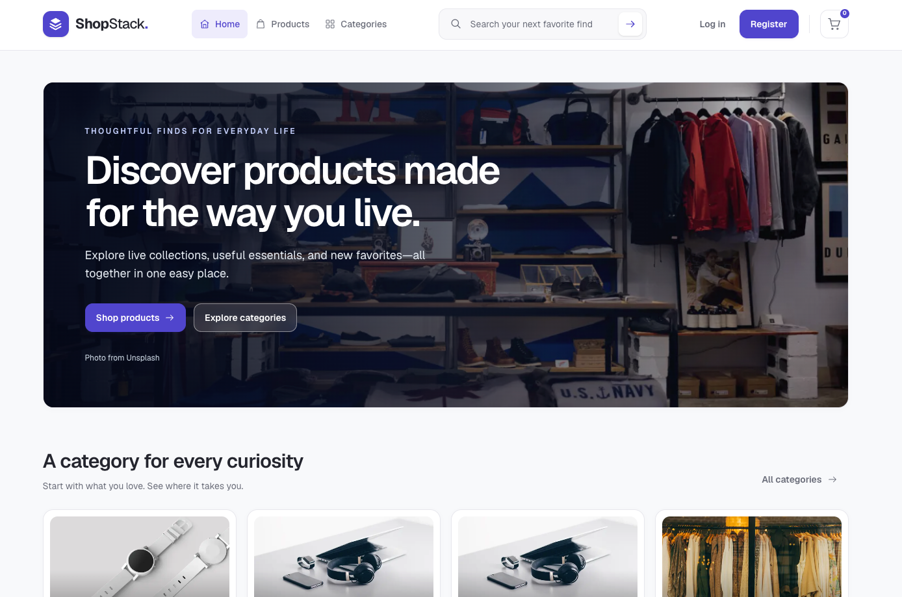

# 🛒 ShopStack — Full-Stack E-Commerce Platform

ShopStack is a modern full-stack e-commerce application that provides customers with a complete shopping experience while giving administrators tools to manage products, categories, users, reviews, orders, and inventory.

The frontend is built with **Next.js, React, TypeScript, and Tailwind CSS** and connects to a secure **Express.js + PostgreSQL** backend.

---

## 📸 Project Preview



---

## ✨ Key Features

### 🛍️ Complete Shopping Experience

- Browse and discover available products
- Search and filter products
- Filter products by category and availability
- View detailed product information
- Check real-time product stock status
- Add products to a shopping cart
- Manage product quantities
- Place orders through a checkout workflow
- View order history and order details
- Submit product ratings and reviews

### 🛒 Smart Cart & Checkout

- Persistent shopping cart
- Add, remove, increase, or decrease product quantities
- Estimated cart subtotal
- Stock-aware quantity validation
- Secure order creation
- Protection against duplicate order submissions
- Automatic cart clearing after successful checkout

> The frontend displays estimated prices, while the backend remains the authoritative source for product pricing and stock availability.

### 📦 Order & Inventory Management

ShopStack uses a secure backend-controlled order workflow.

When a customer places an order, the frontend sends only the product ID and requested quantity:

```json
{
  "items": [
    {
      "productId": "product-id",
      "quantity": 2
    }
  ]
}
```

The backend then:

1. Retrieves the products from PostgreSQL
2. Verifies product availability
3. Validates available inventory
4. Calculates trusted prices on the server
5. Creates the order
6. Updates product stock
7. Prevents purchases when sufficient inventory is unavailable

This prevents manipulated client-side pricing and helps maintain consistent inventory data.

### ⭐ Product Reviews

- View customer reviews
- Submit product ratings and comments
- Edit or delete authorized reviews
- Display product rating information
- Admin review moderation support

### 🔐 Authentication & Authorization

- JWT-based authentication
- User registration and login
- Protected frontend and backend resources
- USER and ADMIN role separation
- Ownership-based access control
- Automatic authentication handling for protected API requests
- Secure logout
- Unauthorized and expired-session handling

### 🛠️ Admin Dashboard

Administrators have access to a dedicated management interface for:

- Products
- Categories
- Users
- Reviews
- Inventory
- Stock monitoring
- Low-stock products
- Other protected administrative resources

Backend authorization remains the primary security layer.

---

## 🧰 Tech Stack

### Frontend

- Next.js
- React
- TypeScript
- Tailwind CSS

### Backend

- Node.js
- Express.js
- TypeScript
- REST API

### Database & ORM

- PostgreSQL
- Prisma ORM

### Authentication & Validation

- JWT
- Zod

### Development & Deployment

- Git
- GitHub
- Vercel

---

## 🏗️ Application Architecture

```text
                         ShopStack
                             │
          ┌──────────────────┴──────────────────┐
          │                                     │
     Customer Store                         Admin Panel
          │                                     │
   ┌──────┼────────────┐              ┌─────────┼─────────┐
   │      │            │              │         │         │
 Home  Products   Product Details   Products Categories Users
                     │                  │
                  Reviews            Reviews
                     │                  │
                   Cart             Inventory
                     │
                 Checkout
                     │
                  Orders
                     │
              Express REST API
                     │
                 Prisma ORM
                     │
                 PostgreSQL
```

---

## 🔄 Customer Workflow

```text
Browse Products
      ↓
Search / Filter
      ↓
View Product Details
      ↓
Add to Cart
      ↓
Manage Cart
      ↓
Checkout
      ↓
Server Validates Stock & Price
      ↓
Order Created
      ↓
Inventory Updated
      ↓
View Order History
```

---

## 👥 User Roles

### 👤 USER

Regular users can:

- Browse products
- Search and filter products
- View product details
- Manage their shopping cart
- Place orders
- View personal order history
- View order details
- Submit product reviews
- Manage authorized personal resources

### 🛡️ ADMIN

Administrators can additionally:

- Manage products
- Manage categories
- Manage users
- Manage inventory
- Moderate reviews
- Access protected administrative pages

---

## 📂 Project Structure

```text
src/
├── app/
│   ├── admin/
│   ├── cart/
│   ├── checkout/
│   ├── login/
│   ├── orders/
│   ├── products/
│   └── register/
│
├── components/
│   ├── admin/
│   ├── cart/
│   ├── products/
│   └── ui/
│
├── context/
│
└── lib/
```

---

## ⚙️ Getting Started

### 1. Clone the frontend repository

```bash
git clone https://github.com/nurhossain-webd/ecommerce-client.git
```

### 2. Navigate to the project

```bash
cd ecommerce-client
```

### 3. Install dependencies

```bash
npm install
```

### 4. Configure Environment Variables

Create a `.env.local` file in the root directory.

```env
NEXT_PUBLIC_API_URL=http://localhost:5001/api
```

Update the URL if your backend runs on a different address.

### 5. Start the Development Server

```bash
npm run dev
```

Open the application in your browser:

```text
http://localhost:3000
```

---

## 🖥️ Backend Setup

ShopStack uses a separate Express.js, Prisma, and PostgreSQL backend.

### Server Repository

https://github.com/nurhossain-webd/ecommerce-server

Clone the backend:

```bash
git clone https://github.com/nurhossain-webd/ecommerce-server.git
```

Then follow the backend repository instructions to configure PostgreSQL, Prisma, environment variables, and the development server.

---

## 🔒 Security Highlights

- JWT authentication
- USER / ADMIN role-based authorization
- Protected REST API endpoints
- Ownership validation
- Zod input validation
- Backend-controlled product pricing
- Server-side stock validation
- Transactional order processing
- Inventory consistency checks
- Soft-delete support for applicable resources
- Protected administrative operations

---

## 📱 Responsive Design

ShopStack provides a responsive experience across:

- 📱 Mobile devices
- 📱 Tablets
- 💻 Laptops
- 🖥️ Desktop screens

The responsive interface includes product grids, navigation, product details, shopping cart, checkout, orders, authentication forms, and administrative interfaces.

---

## 🚀 Future Improvements

Potential future enhancements include:

- Online payment integration
- Shipping address management
- Wishlist functionality
- Product recommendations
- Discount and coupon system
- Email order notifications
- Advanced product search
- Pagination
- Cloud image upload/storage
- Expanded admin analytics

---

## 👨‍💻 Author

**Md Nur Hossain Riyad**

Full-Stack Developer

**GitHub:**  
https://github.com/nurhossain-webd

---

## 📄 License

This project was developed as a full-stack software engineering portfolio project.
